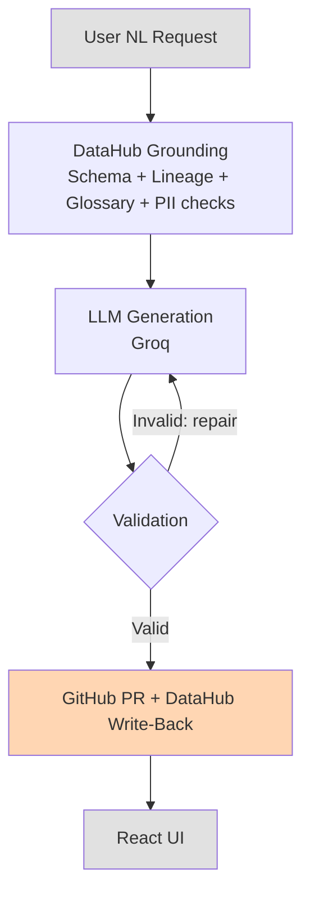

<div align="center">
  <h1>🔗 dgdmg — DataHub-Grounded dbt Model Generator</h1>
  <p><strong>Turn plain English into validated dbt models — grounded in real DataHub metadata, registered back into the catalog, and shipped as a GitHub PR.</strong></p>
  [](#)
  [](#-what-it-does)
  [](#%EF%B8%8F-how-datahub-grounding-prevents-hallucinations)
</div>
---
 
Built for **"Build with DataHub: The Agent Hackathon"**

| | |
|---|---|
| **LLM** | Groq (`llama-3.3-70b-versatile`) — ultra-fast inference via Groq Cloud |
| **Metadata catalog** | DataHub MCP Server (or a built-in mock catalog for local dev / demo) |
| **Version control** | GitHub REST API (create branch → commit → open PR) |

---

## 🎥 Demo

**Video walkthrough:** [TODO: replace with demo video URL]

**Live progress stream:**


**Generated SQL + YAML preview:**


**PR result:**


---

## 🎯 What It Does

A user types something like:

> "Join orders with customer lifetime value, filtered to active accounts"

The agent then:

1. Queries **DataHub** to retrieve the exact schemas, lineage, and business glossary terms relevant to the request, and flags any PII columns or failing data-quality assertions along the way.
2. Asks an **LLM (Groq)** to generate a dbt model — constrained to only use the real table and column names retrieved from DataHub.
3. **Validates** the generated SQL against the DataHub schema, and automatically asks the LLM to repair it if it references anything that doesn't exist (up to 2 retries).
4. Opens a **GitHub PR** with the finished `.sql` model and `schema.yml`, including a rich description covering sources used, lineage, resolved glossary terms, and any PII/assertion warnings.
5. **Writes back to DataHub** — registers the newly generated model as a dataset in the catalog and adds upstream lineage edges from every source table it was built from, so the catalog reflects the new model just like it would for any other dbt run.

---

## 🛡️ How DataHub Grounding Prevents Hallucinations

The LLM cannot invent table or column names:

- Before calling the LLM, the agent fetches the **exact schema** of all relevant DataHub datasets via MCP `search()` and schema-lookup calls.
- The system prompt injects the complete column list for those datasets and explicitly forbids using any identifier that isn't present in that context.
- After generation, a **post-generation validator** (`dbt_generator.py`) checks every `ref()`/`source()` call and every qualified column reference against the DataHub dataset list, flagging anything unknown *before* it's ever committed to GitHub.
- If validation fails, the agent automatically re-prompts the LLM with the specific validation errors and retries — rather than silently shipping broken SQL.

This means the generated SQL is always grounded in the real, current catalog — not the LLM's training-time memory of what a schema might look like.

---

## 🏗️ Architecture



---

## 🚀 Quick Start

### 1. Clone & set up the backend

```bash
git clone https://github.com/LonelyGuy12/dgdmg.git
cd dgdmg/backend
cp .env.example .env
# Edit .env with your credentials (see below)

python -m venv venv
source venv/bin/activate   # Windows: venv\Scripts\activate
pip install -r requirements.txt
```

### 2. Configure `.env`

```bash
# Use the built-in mock catalog (no DataHub instance needed):
USE_MOCK_MCP=true

# OR point at a real DataHub instance:
USE_MOCK_MCP=false
DATAHUB_MCP_URL=https://your-datahub.acryl.io/api/mcp
DATAHUB_TOKEN=your_token

# Optional — override write-back tool names if your DataHub MCP
# server exposes different tool names for writes:
DATAHUB_WRITE_DATASET_TOOL=upsert_dataset_v2
DATAHUB_WRITE_LINEAGE_TOOL=upsert_lineage

# Required for LLM generation:
GROQ_API_KEY=gsk_...
GROQ_MODEL=llama-3.3-70b-versatile   # optional, this is the default

# Required for GitHub PR creation (optional — pipeline runs fine without it,
# PR creation is simply skipped and write-back still runs):
GITHUB_TOKEN=ghp_...
GITHUB_REPO=your-org/dbt-analytics
DBT_MODELS_PATH=models/marts
```

### 3. Start the backend

```bash
cd backend
uvicorn main:app --reload --port 8000
# Runs on http://localhost:8000
```

### 4. Start the frontend

```bash
cd frontend
npm install
npm run dev
# Runs on http://localhost:5173
```

Open **http://localhost:5173** and start generating.

---

## 📁 Project Structure

```
dgdmg/
├── backend/
│   ├── main.py              # FastAPI app + SSE streaming endpoint
│   ├── agent.py              # 8-step orchestration (schema → ... → write-back)
│   ├── datahub_mcp.py         # DataHub MCP client — reads + writes, real & mock
│   ├── mock_mcp.py            # In-memory mock catalog, persists writes to mock-data/
│   ├── dbt_generator.py        # SQL/YAML generation, validation, source extraction
│   ├── github_client.py        # GitHub REST API (branch / commit / PR)
│   ├── test_writeback.py       # Unit tests for the DataHub write-back module
│   └── requirements.txt
├── frontend/
│   └── src/
│       ├── App.jsx
│       └── components/
│           ├── ChatInput.jsx
│           ├── ProgressPanel.jsx
│           ├── ArtifactPreview.jsx
│           └── PRResult.jsx
├── mock-data/
│   ├── datasets.json          # Mock e-commerce catalog (also receives write-backs)
│   ├── lineage.json            # Lineage graph (also receives write-backs)
│   └── glossary.json           # Business glossary terms
└── README.md
```

---

## 🔄 DataHub Write-Back

After a model is generated and validated, the agent registers it back into DataHub so the catalog reflects reality — the same way it would after a real `dbt run`.

- **Dataset registration** — the new model is added as a dataset (platform `dbt`, tagged `GENERATED`), with its column list, descriptions, and PK/FK metadata.
- **Lineage edges** — one upstream edge is added per source table referenced via `ref()`/`source()` in the generated SQL, connecting it to the new model.
- **Idempotent** — re-running the same request doesn't create duplicate lineage edges; duplicates are detected and skipped.
- **Non-fatal** — if write-back fails (e.g. real DataHub is unreachable), it emits a `warning` event without breaking the rest of the pipeline.
- **Runs independently of GitHub** — write-back happens whether or not a PR was actually opened, so it also works in local/no-credentials setups.
- **Mock mode persists to disk** — writes are saved to `mock-data/datasets.json` and `mock-data/lineage.json`, so registered models survive a server restart.

---

## 🎭 Mock DataHub Catalog

For local development and demos, the mock MCP ships a realistic e-commerce data lake:

| Layer | Tables |
|---|---|
| Bronze | `raw_orders`, `raw_customers`, `raw_products` |
| Silver | `stg_orders`, `stg_customers` |
| Gold | `fct_orders`, `dim_customers` |

- **Business terms**: `active_account`, `lifetime_value`, `net_revenue`, `churn_risk`, `order_status`
- **PII columns**: `email`, `phone_number`, `first_name`, `last_name` (tagged in DataHub)
- **Failing assertions**: `raw_customers` has a stale freshness assertion, to demonstrate the governance warning flow

---

## ⚙️ Environment Variables

| Variable | Required | Description |
|---|---|---|
| `USE_MOCK_MCP` | No (default: `true`) | Use the built-in mock DataHub catalog |
| `DATAHUB_MCP_URL` | If not mock | DataHub MCP server URL |
| `DATAHUB_TOKEN` | If not mock | DataHub personal access token |
| `DATAHUB_WRITE_DATASET_TOOL` | No | Override the MCP tool name used for dataset registration |
| `DATAHUB_WRITE_LINEAGE_TOOL` | No | Override the MCP tool name used for lineage writes |
| `GROQ_API_KEY` | Yes | Groq API key — get one free at console.groq.com |
| `GROQ_MODEL` | No (default: `llama-3.3-70b-versatile`) | Groq model ID |
| `GITHUB_TOKEN` | For PRs | GitHub PAT with `repo` scope |
| `GITHUB_REPO` | For PRs | `owner/repo` format |
| `DBT_MODELS_PATH` | For PRs | Path within repo (e.g. `models/marts`) |
| `GITHUB_BASE_BRANCH` | No (default: `main`) | Base branch for PRs |

---

## 🔧 Tech Stack

- **Frontend**: React + Tailwind CSS (Vite)
- **Backend**: Python + FastAPI + Server-Sent Events
- **LLM**: Groq (`llama-3.3-70b-versatile`) via the `groq` Python SDK
- **Data catalog**: DataHub MCP Server (or built-in mock)
- **Version control**: GitHub REST API

---

## ⚠️ Known Limitations

- **Real DataHub mode is implemented but untested against a live instance.** No real DataHub deployment was available during the hackathon, so both the read path and the write-back path have only been verified end-to-end in mock mode (`USE_MOCK_MCP=true`). The real-mode code follows the same MCP tool-call pattern as the mock, but exact tool names may need adjusting via `DATAHUB_WRITE_DATASET_TOOL` / `DATAHUB_WRITE_LINEAGE_TOOL` depending on the target DataHub instance's MCP server.
- **Mock catalog persistence is file-based, not concurrency-safe.** Writes to `mock-data/*.json` work well for local single-user demos but aren't designed for multiple simultaneous writers.
- **LLM output isn't fully deterministic.** The same prompt can occasionally produce a different `model_name` or slightly different SQL between runs, since it depends on Groq's non-deterministic generation.

## 🗺️ Roadmap / Possible Next Steps

- Test and validate the real-DataHub write-back path against a live instance
- Add a "recent runs" history view in the frontend
- Support multi-model generation from a single request

---


<div align="center">
  <i>Built with ❤️ for the future of reliable AI.</i>
</div>
